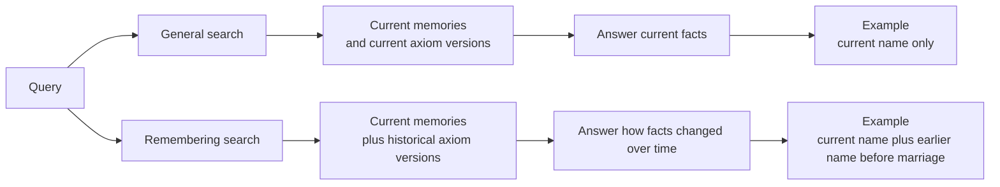

# Memory Types

only-memories treats memory types as behavior hints, not just labels. The type helps decide whether a memory can expire, how it decays, whether cadence matters, how it should be ranked, and whether older versions should be visible in normal searches.

## Type Map

```mermaid
flowchart TB
    M["Memory\nshared fields: type, content, happened_at, source_links, connections, rank"]:::base

    M --> A["Axiom\nidentity-level truth"]:::axiom
    M --> P["Preference\nuser tendency or durable choice"]:::durable
    M --> D["Decision\nexplicit choice made in context"]:::durable
    M --> PR["Project\nongoing body of work"]:::durable
    M --> PE["Person\nrelationship or profile context"]:::durable
    M --> C["Concept\nmodel, idea, or explanation"]:::semantic
    M --> S["Source\nimported origin or evidence record"]:::sourceType
    M --> T["Task\nactionable or planned work"]:::ephemeral
    M --> E["Event\ntime-bound occurrence"]:::ephemeral
    M --> AR["Artifact\nfile, document, repo, image, or output"]:::sourceType
    M --> SK["Skill\nprocedure or reusable capability"]:::semantic
    M --> SY["System\nmachine, app, config, or environment fact"]:::durable
    M --> N["Note\nuncategorized capture"]:::base

    A --> A1["Never expires\nno decay while current"]:::axiomRule
    A --> A2["Versioned by axiom_key\nnew version supersedes old"]:::axiomRule
    A --> A3["General search sees current only\nremembering search can see history"]:::axiomRule

    P --> P1["Usually no hard expiration\ndecays slowly or cadence-driven"]:::rule
    D --> D1["May decay if project context ends\nkept for audit trail"]:::rule
    PR --> PR1["High connection weight\ncentrality often matters"]:::rule
    PE --> PE1["Often durable\nmay contain axiom-like facts through links"]:::rule
    C --> C1["Semantic recall\nconnections shape navigation"]:::rule
    S --> S1["Evidence-first\npoints to origin via source_links"]:::rule
    T --> T1["Often expires or completes\nrank should drop after resolution"]:::rule
    E --> E1["Date-sensitive\nrecency matters strongly"]:::rule
    AR --> AR1["Navigable source object\nfile/repo/doc/photo/link"]:::rule
    SK --> SK1["Procedure memory\nreinforced by successful reuse"]:::rule
    SY --> SY1["Local environment fact\ncan be refreshed by collectors"]:::rule
    N --> N1["Default capture\nagent can later reclassify"]:::rule

    classDef base fill:#f8faf7,stroke:#7c8a85,color:#17211f
    classDef axiom fill:#fff2d6,stroke:#d39434,color:#17211f
    classDef durable fill:#e8f3ef,stroke:#245851,color:#17211f
    classDef semantic fill:#eef2ff,stroke:#4f5f9f,color:#17211f
    classDef sourceType fill:#f2f4f7,stroke:#637083,color:#17211f
    classDef ephemeral fill:#fff0ec,stroke:#ba5a44,color:#17211f
    classDef rule fill:#ffffff,stroke:#c7d0cc,color:#17211f
    classDef axiomRule fill:#fff9ea,stroke:#d39434,color:#17211f
```

## Behavioral Differences

| Type | Best for | Expiration | Decay | Cadence | Versioning | Search behavior |
| --- | --- | --- | --- | --- | --- | --- |
| `axiom` | Identity-level facts that should never die | Never, for the concept | Current version does not decay | Usually none | Yes, by `axiom_key` | General search returns current version; remembering search can include older versions |
| `preference` | User likes, dislikes, working style, defaults | Rare | Slow | Useful | No | Ranked by similarity, importance, cadence, and connections |
| `decision` | Explicit choices and tradeoffs | Sometimes | Medium | Sometimes | No | Useful for audit and project recall |
| `project` | Ongoing work, repos, initiatives | Sometimes | Slow while active | Useful | No | Often becomes central through many connections |
| `person` | People, relationships, profile context | Rare | Slow | Sometimes | No | Can connect to axioms for names, addresses, or identity facts |
| `concept` | Explanations, models, domain ideas | Rare | Medium | Sometimes | No | Strongly navigational; connections matter |
| `source` | Evidence records and imported origins | Rare | Low | None | No | Supports provenance and inspection |
| `task` | Work to do, follow-ups, reminders | Often | Fast after due date or completion | Often | No | Should drop when resolved or stale |
| `event` | Meetings, trips, one-time occurrences | Often | Recency-sensitive | Sometimes | No | Useful for timeline and context recall |
| `artifact` | Files, repos, documents, photos, outputs | Sometimes | Low to medium | Sometimes | No | Should link back to the object via `source_links` |
| `skill` | Reusable procedures and capabilities | Rare | Slow | Useful | No | Reinforced by successful reuse |
| `system` | Device, app, config, environment facts | Sometimes | Medium | Useful | No | Should be refreshed by collectors |
| `note` | Quick capture before classification | Sometimes | Medium | Optional | No | Agent can later reclassify or merge |

## Search Planes

General search is the default for assistants answering direct questions. Remembering search is for historical, audit, identity-continuity, or "what changed?" questions.

## Source Links

Any memory type can include `source_links`. Source links are especially important for `source`, `artifact`, `system`, `person`, and `axiom` memories because they let a user or computer-use adapter navigate back to where the memory came from.

Examples:

- `mac-settings`: system settings, host names, local app configuration.
- `mac-contacts`: people, addresses, birthdays, organizations.
- `photos`: locations, recurring people, trips, events.
- `social-account`: public profile handles and account metadata.
- `file-history`: recent files, project folders, documents, repos.
- `browser`: pages, dashboards, documentation, web apps.
